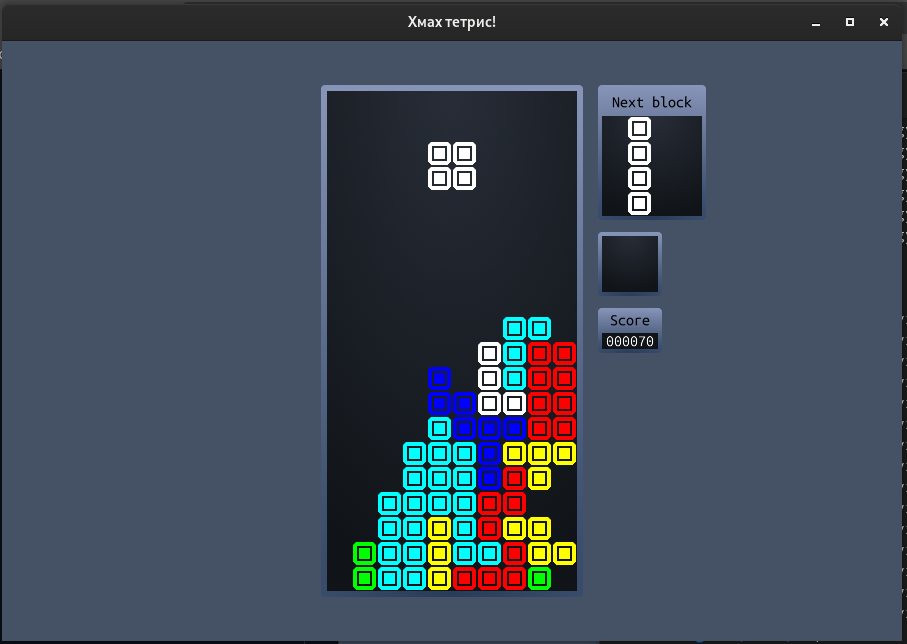
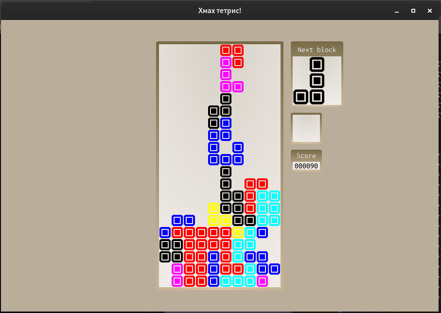

# hmah-tetris

## What is this?

Another attempt to write something working in C and OpenGL.

This time we are writing tetris :)

## Downloads

* [v1.1.0](https://github.com/DoggyXomaX/hmah-tetris/releases/tag/v1.1.0)
* [v1.0.0](https://github.com/DoggyXomaX/hmah-tetris/releases/tag/v1.0.0)

## Screenshots






## Build dependencies

* To compile C btw
  
  

* To make dependencies
  
  

## Linux build

```shell
mkdir build
cd build
cmake .. && cmake --build .
```

## Windows build
```shell
mkdir build
cd build
cmake ..
cmake --build . --config Release
```

## Running

```shell
# In build directory
./tetris
```

## Dependencies

* for matrix transformations

  [](https://github.com/recp/cglm)

* blazingly fast OpenGL core profile loading

  [](https://github.com/skaslev/gl3w)

* for window management, input and sound

  [](https://github.com/libsdl-org/SDL)

* image loading header-only lib (like it, very simple and does its job)

  [](https://github.com/nothings/stb/blob/master/stb_image.h)

## License

[](https://opensource.org/license/mit)